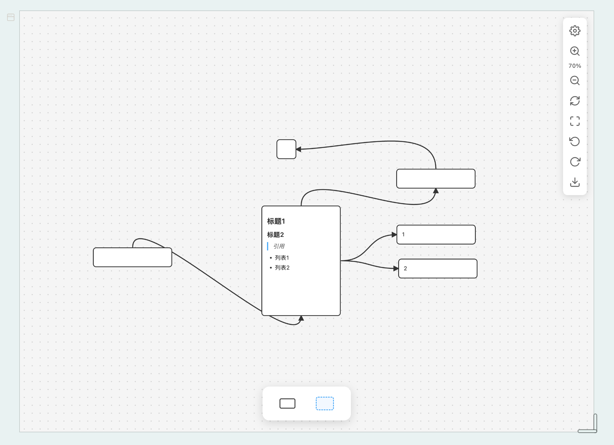

# Canvas 白板 — 思源笔记无限画布挂件

借鉴 Obsidian Canvas 交互体验的思源笔记可视化白板挂件。在无限画布上创建文本卡片、分组容器和连线，数据格式完全兼容 **Obsidian JSON Canvas**。

  

---

## 功能

### Obsidian 兼容
- **JSON Canvas 格式** — 数据以 Obsidian 兼容格式保存（hex 颜色，标准字段）
- **导出 .canvas 文件** — 一键导出到 `data/assets/CanvasFiles/`，自动注册为引用资源
- **跨应用查看** — 导出的 `.canvas` 文件可在 Obsidian 中正确打开，卡片带边框、连线颜色匹配

### 预览与编辑模式
- **预览模式**（默认）— 干净查看：工具栏隐藏，禁止编辑，仅允许平移/缩放/选中
- **编辑模式** — 完整编辑：卡片、连线、缩放、拖拽，工具栏可见
- **悬浮按钮** — 右上角 👁 切换按钮始终可见；**⊞** 总览全局和 **↺** 重置缩放也始终可用

### 卡片
- **文本卡片** — 支持 Markdown 内容，8 种颜色，圆角/直角，实线/虚线边框
- **分组容器** — 虚线蓝色边框，双击标题栏重命名，始终在卡片下方
- **工具栏拖拽** — 从底部工具栏拖出卡片/组按钮，鼠标旁显示缩略预览
- **自动编辑** — 新建文本卡片立即进入编辑模式，`<textarea>` 编辑，换行可靠、Tab 缩进

### 连线
- **贝塞尔曲线** — 从卡片边缘锚点拖出，创建平滑连线
- **锚点吸附** — 拖拽连线靠近目标卡片锚点自动吸附，精准连接
- **箭头标记** — 连线末端显示方向箭头
- **端点重连** — 拖拽连线端点即可重新连接到其他卡片
- **Obsidian 风格连线色** — 柔和灰色（`#7c7c7c`），与 Obsidian 默认风格一致

### 画布与导航
- **无限画布** — 平移（鼠标中键 / 空格+拖拽 / 触摸）、缩放（滚轮 / 双指捏合）
- **悬浮缩放控件** — **⊞** 总览、**↺** 重置始终可见；工具栏内 `+` `−` 百分比显示
- **自适应网格** — 径向点阵网格随缩放自适应
- **触摸设备** — 单指平移、双指缩放

### 选择与编辑
- **单击**选中，**拖拽**移动，**四角四边**调整大小
- **对齐辅助线** — 拖拽时自动吸附到其他卡片的边缘和中心，显示品红色对齐线
- **Option/Alt+拖拽** — 按住 Option（Mac）/ Alt（Win/Linux）拖拽即可复制卡片
- **Option/Alt+Shift+拖拽** — 复制并锁定水平/垂直轴向平移
- **框选** — 空白处拖拽框选多张卡片，再拖拽框选框可整体移动
- **方向键微调** — 方向键（±5px），`Shift+方向键`（±20px）
- **复制/粘贴**（`Ctrl/Cmd+C/V`），**复制副本**（`Ctrl/Cmd+D`），**删除**（`Backspace`）
- **撤销/重做**（`Ctrl/Cmd+Z` / `Ctrl/Cmd+Shift+Z`）— 50 步，严格逐级

### 设置（关闭重开保持）
- **对齐网格** — 默认开启，拖拽时自动吸附 20px 网格
- **对齐物体** — 拖拽时吸附到其他卡片边缘
- **只读模式** — 禁止所有编辑，完全隐藏工具栏
- **导出 PNG**（`Ctrl/Cmd+E`）— 导出到 `data/assets/`

### 存储 — 无文件残留
- **主存储**: 块属性 `custom-canvas-data` — 数据随挂件块生灭，删块即清
- **文件备份**: `data/widgets/siyuan-canvas-widget/data/<块ID>.canvas` — 集中存放在 `data/` 子目录
- **自动保存** — 操作后 300ms 防抖，每次保存同时写入块属性和文件
- **自动迁移** — 旧路径数据（`/data/assets/` 或 widget 扁平目录）加载时自动迁移

---

## 安装

1. 将 `siyuan-canvas-widget/` 复制到思源工作空间的 `data/widgets/` 目录
2. 在思源中输入 `/widget` 搜索「Canvas 白板」插入
3. 从底部工具栏开始添加卡片
4. 点击右上角 👁 按钮切换预览/编辑模式

## 快捷键

| 快捷键 | 操作 |
|--------|------|
| `空格 + 拖拽` / `鼠标中键` | 平移画布 |
| `滚轮` | 缩放 |
| `Delete` / `Backspace` | 删除选中（仅编辑模式） |
| `Ctrl/Cmd+A` | 全选 |
| `Escape` | 取消选择 |
| `Ctrl/Cmd+C/V` | 复制 / 粘贴（粘贴仅编辑模式） |
| `Ctrl/Cmd+D` | 复制副本（仅编辑模式） |
| `Ctrl/Cmd+Z` / `Ctrl/Cmd+Y` | 撤销 / 重做 |
| `Ctrl/Cmd+F` | 搜索卡片 |
| `Ctrl/Cmd+S` | 强制保存 |
| `Ctrl/Cmd+E` | 导出 PNG |
| `Option/Alt+拖拽` | 复制卡片（仅编辑模式） |
| `Option/Alt+Shift+拖拽` | 复制 + 轴向锁定（仅编辑模式） |
| `方向键` | 微调选中 ±5px（仅编辑模式） |
| `Shift+方向键` | 微调选中 ±20px（仅编辑模式） |

## 许可证

MIT
